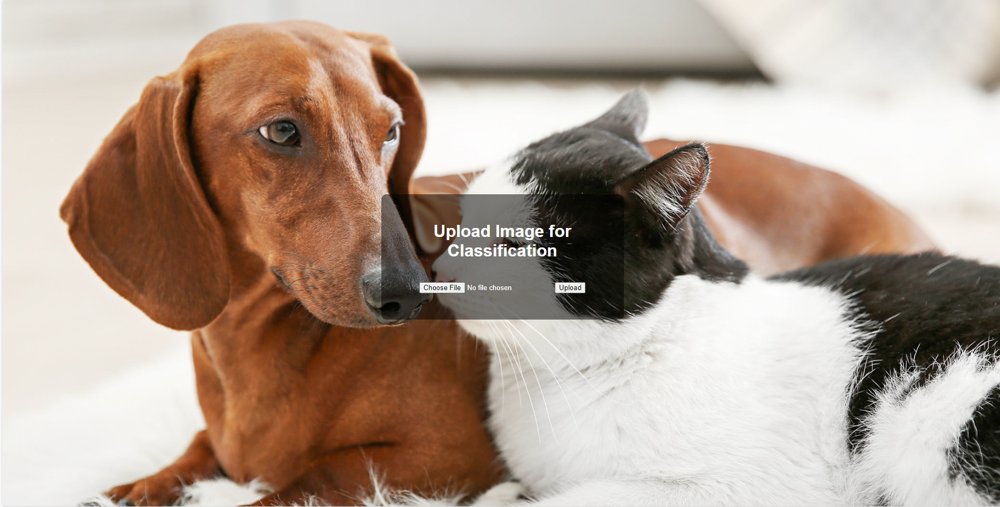
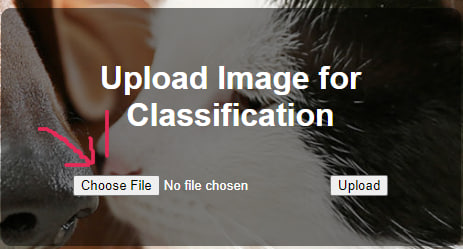
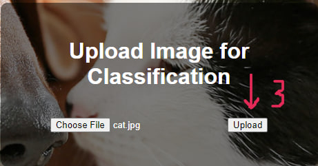
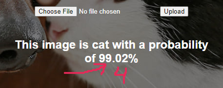

<a id="readme-top"></a>
# Cat and dog classifier 😺 🐶

Project based on machine learning and kernel models



## Table Of Content

- [Installation](#installation)
    - [Setting up python](#setting-up-python)
    - [Starting the project](#start-project)
    - [(Optional) Run with Docker](#optional-run-project-with-docker)
- [Page setup](#page-setup)
- [Project configuration](#project-configuration)
- [License](#license)
- [Links](#links)

## Installation

### Setting up python

**Note:** Python 3.10+ is required!

1. Clone repository  
```shell
git clone https://github.com/dimak20/cat_dog_project
cd cat_dog_project
```
2. Then, create and activate .venv environment  
```shell
python -m venv env
```
For Unix system
```shell
source venv/bin/activate
```

For Windows system

```shell
venv\Scripts\activate
```

3. Install requirements.txt by the command below  


```shell
pip install -r requirements.txt
```

### Start project

*Note:* Make sure port 5000 is open.

1. Start the server on your local machine 
```shell
python -m flask run
```
Debug is True by default (you can change it in app.py)  ->  app.run(debug=False)

### (Optional) Run project with Docker

1. Build docker image with your lables
```shell
docker build <label_name> .
```

2. Run docker image
```shell
docker run -p 5000:5000 <label_name>
```


## Page Setup

The home page (root page) allows you to upload a photo. After selecting the file, wait for the result to be displayed.

1. Click on the "Choose File" button.  
   

2. Select the photo you want to upload.  
   

3. Click on the "Upload" button.  
   

4. View the prediction result.  
   

<p align="right">(<a href="#readme-top">back to top</a>)</p>

## License

Cat and dog classifier is licensed under the terms of the GPL Open Source
license and is available for free.

### Project configuration

Your project needs to have this structure

```plaintext
Project
├── .venv
|
├── readme_static
│
├── static
│   ├── background
│   ├── images
│   ├── models
|   ├  ├── cat_dog.keras
|   ├  └──cat_dog_second.keras
│   └── uploads
|
├── templates
│   └── index.html
│
├── .dockerignore
|   
├── .gitignore
│   
├── app.py
|
├── classifier.py
|
├── docker_requirements.txt
|
├── Dockerfile
│
├── LICENSE
│
├── README.md
|
└── requirements.txt
```

## Links

* [Colab research](https://colab.research.google.com/drive/1UTKBqlIZj3InPYsaPMS2YJlIddZe3yV8?usp=sharing)
<p align="right">(<a href="#readme-top">back to top</a>)</p>
